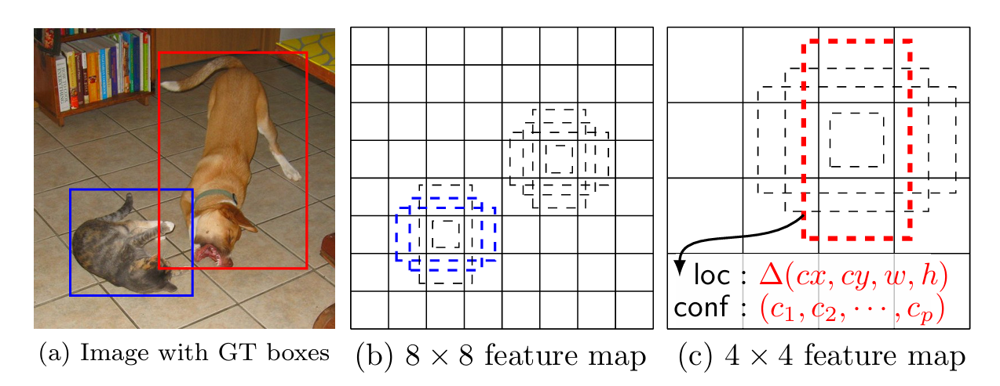

**Anchor-base&Anchor-free的源码下载链接**：[https://github.com/KeepTryingTo/DeepLearning/tree/main](https://github.com/KeepTryingTo/DeepLearning/tree/main "https://github.com/KeepTryingTo/DeepLearning/tree/main")

**个人博客主页**：[https://blog.csdn.net/Keep_Trying_Go?spm=1010.2135.3001.5421](https://blog.csdn.net/Keep_Trying_Go?spm=1010.2135.3001.5421 "https://blog.csdn.net/Keep_Trying_Go?spm=1010.2135.3001.5421")

**视频讲解**：[https://www.bilibili.com/video/BV1YBeGeNEtX/](https://www.bilibili.com/video/BV1YBeGeNEtX/ "https://www.bilibili.com/video/BV1YBeGeNEtX/")

# 基于锚框（anchor-base）的目标检测算法#
**基于anchor的方法最初来源于Faster R-CNN目标检测算法这篇论文，后续在很多算法论文中都采用了这个方法，并且从实际效果上来看的话，定位准确率上确实得到了提升。因此，后面很多相关的目标检测算法都采用anchor，anchor就是根据高宽比预先生成的坐标框，anchor高宽比的设定根据经验来设置的，比如设定汽车矮胖之类的anchor的高宽比应该大致是1:2之类的，设定人高瘦之类的anchor高宽比应该大致是3:1之类的。**

**这里我将基于anchor的相关典型算法使用时间轴的方式给列举了出来，以便于查看和算法时间比较：** 


**Anchor的特点如下：**

- anchor的生成：将预测头head输出的特征图划分为N X N的网格大小，每一个网格中心作为不同尺寸比anchor中心点。
- 目标匹配：首先将图像上实际标注框和锚框进行匹配，匹配的过程是基于最大交并比（IOU-Intersection over Union)等指标进行正负样本的划分。
- 预测输出：网络head预测输出每个锚框的分类和回归信息，用于损失的计算和推理。


其实上面的解释都可以使用SSD中的一幅图来解释：当原图中包含两个物体，经过CNN之后得到不同大小的特征图（多尺度特征图），由于不同的特征图是经过不同的下采样步长得到的，因此，根据特征图大小划分的网格所对应的感受野大小也不同，设置的anchor高宽比也不同。最终输出的小尺寸特征图负责预测大物体（感受野大），输出的大尺寸特征图负责预测小物体（感受野小）。



参考过的链接如下：

- [https://github.com/sgrvinod/a-pytorch-tutorial-to-object-detection](https://github.com/sgrvinod/a-pytorch-tutorial-to-object-detection "进入anchor-base的教程")
- [https://zhuanlan.zhihu.com/p/577062283](https://zhuanlan.zhihu.com/p/577062283 "https://zhuanlan.zhihu.com/p/577062283")


论文下载链接：

1.[Faster R-CNN: Towards Real-Time Object Detection with Region Proposal Networks](https://arxiv.org/pdf/1506.01497v3.pdf "")（Faster R-CNN)

2.[YOLO9000: Better, Faster, Stronger](https://arxiv.org/pdf/1612.08242v1.pdf "YOLO9000: Better, Faster, Stronger")(YOLOv2)

3.[SSD: Single Shot MultiBox Detector](https://arxiv.org/abs/1512.02325v5 "SSD: Single Shot MultiBox Detector")(SSD)

4.[Inception Single Shot MultiBox Detector for object detection](https://ieeexplore.ieee.org/document/8026312 "Inception Single Shot MultiBox Detector for object detection")(I-SSD)

5.[DSSD : Deconvolutional Single Shot Detector](https://arxiv.org/pdf/1701.06659v1.pdf "DSSD : Deconvolutional Single Shot Detector")(DSSD)

6.[Feature Pyramid Networks for Object Detection](https://arxiv.org/pdf/1612.03144v2.pdf "Feature Pyramid Networks for Object Detection")(FPN)

7.[YOLOv3: An Incremental Improvement](https://arxiv.org/abs/1804.02767v1 " YOLOv3: An Incremental Improvement")(YOLOv3)

8.[Receptive Field Block Net for Accurate and Fast Object Detection](https://arxiv.org/pdf/1711.07767v3.pdf "Receptive Field Block Net for Accurate and Fast Object Detection")(RFBNet)

9.[Parallel Feature Pyramid Network for Object Detection](http://openaccess.thecvf.com/content_ECCV_2018/papers/Seung-Wook_Kim_Parallel_Feature_Pyramid_ECCV_2018_paper.pdf "Parallel Feature Pyramid Network for Object Detection")(P2PNet)

10.[Single-Shot Refinement Neural Network for Object Detection](https://arxiv.org/pdf/1711.06897v3.pdf "Single-Shot Refinement Neural Network for Object Detection")(RefineDet)

11.[Scale-Transferrable Object Detection](http://openaccess.thecvf.com/content_cvpr_2018/papers/Zhou_Scale-Transferrable_Object_Detection_CVPR_2018_paper.pdf "Scale-Transferrable Object Detection")(STDL)

12.[Focal Loss for Dense Object Detection](https://arxiv.org/pdf/1708.02002v2.pdf "Focal Loss for Dense Object Detection")(RetinaNet)

13.[YOLOv4: Optimal Speed and Accuracy of Object Detection](https://arxiv.org/abs/2004.10934v1 "YOLOv4: Optimal Speed and Accuracy of Object Detection")(YOLOv4)

14.[YOLOv5](https://github.com/ultralytics/yolov5 "https://github.com/ultralytics/yolov5")

15.[ EfficientDet: Scalable and Efficient Object Detection](https://arxiv.org/abs/1911.09070v7 " EfficientDet: Scalable and Efficient Object Detection")

16.[YOLOX: Exceeding YOLO Series in 2021](https://arxiv.org/pdf/2107.08430v2.pdf "YOLOX: Exceeding YOLO Series in 2021")

17.[TPH-YOLOv5: Improved YOLOv5 Based on Transformer Prediction Head for Object Detection on Drone-captured Scenarios](https://arxiv.org/pdf/2107.08430v2.pdf "TPH-YOLOv5: Improved YOLOv5 Based on Transformer Prediction Head for Object Detection on Drone-captured Scenarios")

18.[Anchor DETR: Query Design for Transformer-Based Object Detection](https://arxiv.org/pdf/2109.07107v2.pdf "Anchor DETR: Query Design for Transformer-Based Object Detection")

19.[YOLOv10](https://github.com/THU-MIG/yolov10 "YOLOv10")


20.[Receptive Field Block Net for Accurate and Fast Object Detection](https://arxiv.org/pdf/1711.07767v3.pdf "Receptive Field Block Net for Accurate and Fast Object Detection")(RFBNet)

21.[FSSD: Feature Fusion Single Shot Multibox Detector](https://arxiv.org/pdf/1712.00960v4.pdf "FSSD: Feature Fusion Single Shot Multibox Detector")

22.[M2Det: A Single-Shot Object Detector based on Multi-Level Feature Pyramid Network](https://arxiv.org/pdf/1811.04533v3.pdf "M2Det: A Single-Shot Object Detector based on Multi-Level Feature Pyramid Network")


# Faster R-CNN Anchor Box #


从Faster R-CNN中所绘制的图像以及文字表述来看，定义anchor box作为滑动窗口的中心，并且设置3中不同尺度和3中不同比例的box大小，从而K = 3 x 3 = 9中不同类型的anchor box，因此如果一个特征输出的特征图大小为H X W，那么这个特征图上形成的anchor box数量为HWK个。

由于anchor box是位于网格中心（特征图点中心），因此具有平移不变性。无论是在锚框（anchors）还是在计算相对于锚框的候选框（proposals）。如果图像中的物体发生平移，则候选框应当相应平移，并且相同的函数应该能够预测物体在任一位置的候选框。通过使用anchor box保证了这种平移不变性。相比之下，MultiBox（[Scalable,
high-quality object detection](https://arxiv.org/pdf/1412.1441v3.pdf "https://arxiv.org/pdf/1412.1441v3.pdf")） 方法使用 k-means 生成 800 个锚框，但这些锚框并不具有平移不变性。因此，如果物体发生平移，MultiBox 不保证生成相同的提议。

平移不变性还减少了模型的大小。MultiBox 的输出层是一个 (4 + 1) × 800 维的全连接层，Faster R-CNN的方法在 k = 9 且有锚框的情况下，输出层为 (4 + 2) × 9 维的卷积层。因此，在 VGG-16 的情况下，Faster R-CNN的输出层有 2.8 × 10⁴ 个参数（512 × (4 + 2) × 9），这是 MultiBox 输出层的两个数量级更少，后者有 6.1 × 10⁶ 个参数（1536 × (4 + 1) × 800，基于 GoogleNet 中的 MultiBox）。如果考虑特征投影层，我们的提议层在参数数量上仍比 MultiBox 少一个数量级。我们预计，当在较小的数据集（如 PASCAL VOC）上进行训练时，我们的方法更不容易出现过拟合。


## anchor-box的生成方式 ##

**第一种：以SSD作为例子**


**第二种：以YOLOv2作为例子**


*： YOLOv2中得到anchor的方式是通过对训练集上所有的标注框使用K-Means算法聚类自动分类得到，代替了手工涉及anchor box高宽比的方式，因为在训练集上聚类得到的anchor box符合大部分物体的检测大小，因此得到的anchor box对于模型的学习具有一定的好处。其中上面给出的就是YOLOv2中采用聚类算法绘制的各个anchor box，左边这幅图展示了随着指定的聚类簇值越大，效果越好，但是同样算法复杂性也在变高，因此，通过平衡最终选择K=5作为聚类簇大小，从图中就可以看到最终聚类得到的5种anchor box类型。如下表也给出了选择不同的K最终模型效果。


*： 其中标准的K-Means算法采用的是欧式距离作为衡量指标，那么大的anchor box比小的anchor box具有更大的误差。因此，作者采用两个框之间的IOU（交集）作为衡量指标，但是我们要知道在聚类过程中，一个点会被加入距离最近的那个簇，而这里采用IOU，也就是两个边框之间的交集，交集越大，IOU越大，所以最终以1 - IOU作为评价指标，IOU越大代表两个边框靠的越近。


**以SSD中Anchor Box和GT Box之间的匹配来看：**

[GT Box和Anchor box之间的最佳匹配过程](https://mydreamambitious.blog.csdn.net/article/details/143270390 "https://mydreamambitious.blog.csdn.net/article/details/143270390")

第一步：看看SSD最后输出的6个特征图大小以及可以检测的总的类别数


第二步：计算GT Box和Prior box（anchor box）之间的中心偏移以及高宽比值


具体代码实现如下：

```

	g_cxcy = (matched[:, :2] + matched[:, 2:])/2 - priors[:, :2]
	
	g_cxcy /= (variances[0] * priors[:, 2:])
	
	g_wh = (matched[:, 2:] - matched[:, :2]) / priors[:, 2:]
	
	g_wh = torch.log(g_wh) / variances[1]
	其中matched表示gt box和prior box之间计算IOU之后最大匹配的结果，表示和prior box最佳匹配的那些gt box。
```


以计算的中心偏移和高宽比值作为网络的预测结果进行回归训练，训练完成之后进行单张图像的推理，推理的过程中基于prior box（anchor box）进行预测结果的解码操作，具体解码代码如下：

```

	boxes = torch.cat((
	        priors[:, :2] + loc[:, :2] * variances[0] * priors[:, 2:],
	        priors[:, 2:] * torch.exp(loc[:, 2:] * variances[1])), 1)
	
	boxes[:, :2] -= boxes[:, 2:] / 2
	
	boxes[:, 2:] += boxes[:, :2]
	
	根据编码之后训练完成得到对应模型，在推理部分对预测进行反解码得到最终的预测box
```

**关于Gt Box和anchor box（prior box）之间的**[匹配过程详解](https://mydreamambitious.blog.csdn.net/article/details/143270390 "https://mydreamambitious.blog.csdn.net/article/details/143270390")**以及**[视频讲解链接](https://www.bilibili.com/video/BV1YBeGeNEtX?vd_source=b2eaaddb2c69bf42517a2553af8444ab&p=3&spm_id_from=333.788.videopod.episodes "https://www.bilibili.com/video/BV1YBeGeNEtX?vd_source=b2eaaddb2c69bf42517a2553af8444ab&p=3&spm_id_from=333.788.videopod.episodes")


**基于anchor的一些论文算法详解链接如下：**

| 论文详解链接        
| ---------  
|[ 论文Receptive Field Block Net for Accurate and Fast Object Detection详解（+代码详解） ](https://mydreamambitious.blog.csdn.net/article/details/143270390 "https://mydreamambitious.blog.csdn.net/article/details/143270390")
| [论文ASSD: Attentive Single Shot Multibox Detector详解（包含代码详解）](https://mydreamambitious.blog.csdn.net/article/details/143247917 "https://mydreamambitious.blog.csdn.net/article/details/143247917") 
| [论文FSSD: Feature Fusion Single Shot Multibox Detector详解（代码详解）](https://mydreamambitious.blog.csdn.net/article/details/143363665 "https://mydreamambitious.blog.csdn.net/article/details/143363665")
|[论文Feature-Fused SSD: Fast Detection for Small Objects 详解（包括代码详解）](https://mydreamambitious.blog.csdn.net/article/details/143313665 "https://mydreamambitious.blog.csdn.net/article/details/143313665")
|[论文Parallel Feature Pyramid Network for Object Detection 详解（包含代码详解）](https://mydreamambitious.blog.csdn.net/article/details/143508021 "https://mydreamambitious.blog.csdn.net/article/details/143508021")
|[论文Inception Single Shot MultiBox Detector For Object Detection 详解（代码详解）](https://mydreamambitious.blog.csdn.net/article/details/143603094 "https://mydreamambitious.blog.csdn.net/article/details/143603094")
|[论文DSSD:Deconvolutional Single Shot Detector详解（包含代码详解）](https://mydreamambitious.blog.csdn.net/article/details/143461579 "https://mydreamambitious.blog.csdn.net/article/details/143461579")
|[论文Generalized Intersection over Union: A Metric and A Loss for Bounding Box Regression 详解（算法代码实现详解）](https://mydreamambitious.blog.csdn.net/article/details/143495883 "https://mydreamambitious.blog.csdn.net/article/details/143495883")
|[论文Distance-IoU Loss: Faster and Better Learning for Bounding Box Regression详解（包含代码详解）](https://mydreamambitious.blog.csdn.net/article/details/143477078 "https://mydreamambitious.blog.csdn.net/article/details/143477078")
|[论文M2Det: A Single-Shot Object Detector based on Multi-Level Feature Pyramid Network 详解（包含代码详解）](https://mydreamambitious.blog.csdn.net/article/details/143466301 "https://mydreamambitious.blog.csdn.net/article/details/143466301")
|[论文Parallel Feature Pyramid Network for Object Detection 详解（包含代码详解）](https://mydreamambitious.blog.csdn.net/article/details/143508021 "https://mydreamambitious.blog.csdn.net/article/details/143508021")
|[论文Soft-NMS– Improving Object Detection With One Line of Code 详解](https://mydreamambitious.blog.csdn.net/article/details/143666412 "https://mydreamambitious.blog.csdn.net/article/details/143666412")
|[论文S3FD: Single Shot Scale-invariant Face Detector 详解（代码详解）](https://mydreamambitious.blog.csdn.net/article/details/143666910 "https://mydreamambitious.blog.csdn.net/article/details/143666910")
|[论文Scale-Transferrable Object Detection 详解（代码详解）](https://mydreamambitious.blog.csdn.net/article/details/143667298 "https://mydreamambitious.blog.csdn.net/article/details/143667298")
|[论文Single-Shot Refinement Neural Network for Object Detection 详解（代码详解）](https://mydreamambitious.blog.csdn.net/article/details/143696667 "https://mydreamambitious.blog.csdn.net/article/details/143696667")
|[论文Pelee: A Real-Time Object Detection System on Mobile Devices详解（代码详解）](https://mydreamambitious.blog.csdn.net/article/details/143724189 "https://mydreamambitious.blog.csdn.net/article/details/143724189")
|[论文Tiny-DSOD: Lightweight Object Detection for Resource-Restricted Usages详解（代码详解）](https://mydreamambitious.blog.csdn.net/article/details/143725261 "https://mydreamambitious.blog.csdn.net/article/details/143725261")
|[论文FaceBoxes: A CPU Real-time Face Detector with High Accuracy详解（代码）](https://mydreamambitious.blog.csdn.net/article/details/144095444 "https://mydreamambitious.blog.csdn.net/article/details/144095444")
|[论文Learning Spatial Fusion for Single-Shot Object Detection详解（代码）](https://mydreamambitious.blog.csdn.net/article/details/144066826 "https://mydreamambitious.blog.csdn.net/article/details/144066826")
|[论文An Energy and GPU-Computation Efficient Backbone Network for Real-Time Object Detection详解（代码详解）](https://mydreamambitious.blog.csdn.net/article/details/143925085 "https://mydreamambitious.blog.csdn.net/article/details/143925085")
|[论文PyramidBox: A Context-assisted Single Shot Face Detector详解（代码详解）](https://mydreamambitious.blog.csdn.net/article/details/144247492 "https://mydreamambitious.blog.csdn.net/article/details/144247492")
|[论文RetinaFace: Single-stage Dense Face Localisation in the Wild详解](https://mydreamambitious.blog.csdn.net/article/details/144269518 "https://mydreamambitious.blog.csdn.net/article/details/144269518")

----------


# 不需要锚框（anchor-free）的目标检测算法 #
**基于anchor-free的方法最初来源于DenseBox算法，不需要anchor作为基准去做预测调整，而是直接回归目标框，这种方法在后续的论文算法中也得到了很多的应用，其中典型的有YOLOv1,FCOS,CornerNet等anchor-free算法，并且anchor-free的方法也比较受欢迎。基于anchor-free的算法更加的好理解，但是其也有缺点。**

**这里同时也将anchor-free相关算法使用时间轴的方式给表示了出来：**


anchor-free的特点如下：

- 无需anchor：不依赖于预先设定的框，直接对预测head输出结果进行回归。
- 关键点回归：比如CornerNet采用heatmap进行目标中心的预测或FCOS者直接回归边界框的四个角点或者边界。
- 简化网络结构：不需要anchor，网络结构稍微变得更加简洁和高效。


论文下载链接：

1.[DenseBox: Unifying Landmark Localization with End to End Object Detection](https://arxiv.org/pdf/1509.04874v3.pdf "DenseBox: Unifying Landmark Localization with End to End Object Detection")

2.[UnitBox: An Advanced Object Detection Network](https://arxiv.org/pdf/1608.01471v1.pdf "UnitBox: An Advanced Object Detection Network")

3.[You Only Look Once: Unified, Real-Time Object Detection](https://arxiv.org/pdf/1506.02640v5.pdf "You Only Look Once: Unified, Real-Time Object Detection")(YOLOv1)

4.[CornerNet: Detecting Objects as Paired Keypoints](https://arxiv.org/pdf/1808.01244v2.pdf "CornerNet: Detecting Objects as Paired Keypoints")

5.[Feature Selective Anchor-Free Module for Single-Shot Object Detection](https://arxiv.org/pdf/1903.00621v1.pdf "Feature Selective Anchor-Free Module for Single-Shot Object Detection")(FSAF)

6.[FCOS: Fully Convolutional One-Stage Object Detection](https://arxiv.org/pdf/1904.01355v5.pdf "FCOS: Fully Convolutional One-Stage Object Detection")

7.[AutoAssign: Differentiable Label Assignment for Dense Object Detection](https://arxiv.org/pdf/2007.03496v3.pdf "AutoAssign: Differentiable Label Assignment for Dense Object Detection")

8.[Center and Scale Prediction: Anchor-free Approach for Pedestrian and Face Detection](https://arxiv.org/pdf/1904.02948v4.pdf "Center and Scale Prediction: Anchor-free Approach for Pedestrian and Face Detection")(CSP)

9.[AFDet: Anchor Free One Stage 3D Object Detection](https://arxiv.org/pdf/2006.12671v2.pdf "AFDet: Anchor Free One Stage 3D Object Detection")(AFDet)

10.[Corner Proposal Network for Anchor-free, Two-stage Object Detection](https://arxiv.org/pdf/2007.13816v1.pdf "Corner Proposal Network for Anchor-free, Two-stage Object Detection")(CPN)

11.[End-to-End Object Detection with Transformers](https://arxiv.org/pdf/2005.12872v3.pdf "End-to-End Object Detection with Transformers")(DETR)

12.[PAFNet: An Efficient Anchor-Free Object Detector Guidance](https://arxiv.org/pdf/2104.13534v1.pdf "PAFNet: An Efficient Anchor-Free Object Detector Guidance")(PAFNet)

13.[FCAF3D: Fully Convolutional Anchor-Free 3D Object Detection](https://arxiv.org/pdf/2112.00322v2.pdf "FCAF3D: Fully Convolutional Anchor-Free 3D Object Detection")

14.[YOLOv6: A Single-Stage Object Detection Framework for Industrial Applications](https://arxiv.org/pdf/2209.02976v1.pdf "YOLOv6: A Single-Stage Object Detection Framework for Industrial Applications")

15.[YOLOv7: Trainable bag-of-freebies sets new state-of-the-art for real-time object detectors](https://arxiv.org/pdf/2207.02696v1.pdf "YOLOv7: Trainable bag-of-freebies sets new state-of-the-art for real-time object detectors")

16.[Reducing Label Noise in Anchor-Free Object Detection](https://arxiv.org/pdf/2008.01167v2.pdf "Reducing Label Noise in Anchor-Free Object Detection")(PPDet)

17.[PP-YOLOE-R: An Efficient Anchor-Free Rotated Object Detector](https://arxiv.org/pdf/2211.02386v1.pdf "PP-YOLOE-R: An Efficient Anchor-Free Rotated Object Detector")

18.[Localization Uncertainty Estimation for Anchor-Free Object Detection](https://arxiv.org/pdf/2006.15607v6.pdf "Localization Uncertainty Estimation for Anchor-Free Object Detection")(UFL)


| 论文详解链接        
| --------- 
|[论文FCOS: Fully Convolutional One-Stage Object Detection详解（代码详解）](https://mydreamambitious.blog.csdn.net/article/details/144010894 "https://mydreamambitious.blog.csdn.net/article/details/144010894") （推理阶段需要使用NMS算法去掉重叠度高的框）
|[论文Objects as Points详解（CenterNet）](https://mp.csdn.net/mp_blog/creation/editor/144179082 "https://mp.csdn.net/mp_blog/creation/editor/144179082")（推理阶段不需要使用NMS算法）


**这里以FCOS和CenterNet为例子对heatmap以及坐标框的预测来进行讲解：**

**（1）FCOS中heatmap和坐标框的预测表示方法**


从图中可以看到生成的heatmap维度为[B，C，H，W]，其中B表示批次大小，C表示预测的类别数，比如VOC对应20个类别，COCO对应80个类别，H和W表示预测特征图大小。pred_heatmap = [B，C，H，W] => [B, H* W, C]，对应的真实gt_heatmap = [B, H * W, 1]，如果该位置为1，表示有物体，用于类别损失计算。

解码阶段对于pred_heatmap的操作：

````

	cls_scores,cls_classes=torch.max(cls_preds,dim=-1)#[batch_size,sum(_h*_w)]
	
	if self.config.add_centerness:
	
	    计算预测类别概率 X 预测得到的center_ness
	
	    cls_scores=cls_scores*(cnt_preds.squeeze(dim=-1))#[batch_size,sum(_h*_w)]

	cls_classes=cls_classes+1#[batch_size,sum(_h*_w)]
	
	将预测得到的reg_preds偏移加上coords网格坐标 [l*,t*,r*,b*] => [xmin,ymin,xmax,ymax]
	
	boxes=self._coords2boxes(coords,reg_preds)#[batch_size,sum(_h*_w),4]
	
	select topk 选择前K个预测结果
	
	max_num=min(self.max_detection_boxes_num,cls_scores.shape[-1])
	
	得到前K个最大scores值的索引
	
	topk_ind=torch.topk(cls_scores,max_num,dim=-1,largest=True,sorted=True)[1]#[batch_size,max_num]
	
	_cls_scores=[]
	
	_cls_classes=[]
	
	_boxes=[]
	
	针对batchsize进行遍历
	
	for batch in range(cls_scores.shape[0]):
	
	    得到相应的前K中的类别概率
	
	    _cls_scores.append(cls_scores[batch][topk_ind[batch]])#[max_num]
	
	    得到相应的前K中的类别索引
	
	    _cls_classes.append(cls_classes[batch][topk_ind[batch]])#[max_num]
	    
	cls_scores_topk=torch.stack(_cls_scores,dim=0)#[batch_size,max_num]

	cls_classes_topk=torch.stack(_cls_classes,dim=0)#[batch_size,max_num]
```


对于坐标框的表示方法不同于anchor-based的表示，一般的anchor-based表示方法为[cx,cy,w,h]，但是在FCOS中坐标框的表示方法如下图所示：


下图表示计算gt box和中心网格得到上面提到的（l* ,t * ,r* , b*）


对应的解码操作为：其中的（l* ,t * ,r* , b*）表示预测的偏移量，(x,y)表示中心网格坐标。

```

	xmin = x - l* , ymin = y - t*
	
	xmax = x + r* , ymax = y + b*

```


由于远离GT Box的那些预测框并不是想要的，因此为了抑制那些低质量的坐标框，提出采用中心度的方式；预测输出的中心度表示pred_center_ness = [B, H, W, 1]，最终在解码阶段使用预测的中心度和预测的heatmap分数相乘得到最终预测的置信度结果。


**（2）CenterNet中heatmap和坐标框的预测表示方法**

CenterNet预测的输出中包含三项：heatmap预测，中心坐标偏移预测以及坐标框高宽预测，它们的表示方法看下面的图。


关于heatmap，中心坐标偏移以及坐标框高宽的编码过程，请看[论文Objects as Points详解](https://mydreamambitious.blog.csdn.net/article/details/144179082 "https://mydreamambitious.blog.csdn.net/article/details/144179082")


对预测的heatmap进行解码：

第一步：首先特征图最外层进行了填充，采用最大池化并且窗口大小为3x3进行滑动，得到那些响应值最大的，作为最后的预测分数。


```

	def _nms(heat, kernel=3):
	    pad = (kernel - 1) // 2
	    hmax = nn.functional.max_pool2d(
	        heat, (kernel, kernel), stride=1, padding=pad)
	    keep = (hmax == heat).float()
	    return heat * keep

```

第二步：过滤掉那些低置信度的分数，根据设置的每张图像最多预测多少个物体的阈值进行过滤。

```

	def _gather_feat(feat, ind, mask=None):
	    dim  = feat.size(2)
	    ind  = ind.unsqueeze(2).expand(ind.size(0), ind.size(1), dim)
	    feat = feat.gather(1, ind)
	    if mask is not None:
	        mask = mask.unsqueeze(2).expand_as(feat)
	        feat = feat[mask]
	        feat = feat.view(-1, dim)
	    return feat

	def _topk(scores, K=40):
	    batch, cat, height, width = scores.size()
	    #TODO 默认在dim = -1上选择预测概率最大的前K个
	    topk_scores, topk_inds = torch.topk(scores.view(batch, cat, -1), k=K)
	
	    #TODO 通过预测的索引获得Y和X轴坐标
	    topk_inds = topk_inds % (height * width)
	    topk_ys   = (topk_inds / width).int().float()
	    topk_xs   = (topk_inds % width).int().float()
	
	    #TODO 再在预测概率最大的分数里面选择dim=-1维度获得前K个概率最大的
	    topk_score, topk_ind = torch.topk(topk_scores.view(batch, -1), K)
	    #TODO 然后或者类别索引
	    topk_clses = (topk_ind / K).int()
	    #TODO 同时选择对应的位置坐标
	    topk_inds = _gather_feat(
	        feat = topk_inds.view(batch, -1, 1),
	        ind = topk_ind
	    ).view(batch, K)
	    topk_ys = _gather_feat(topk_ys.view(batch, -1, 1), topk_ind).view(batch, K)
	    topk_xs = _gather_feat(topk_xs.view(batch, -1, 1), topk_ind).view(batch, K)
	
	    return topk_score, topk_inds, topk_clses, topk_ys, topk_xs
	#TODO 返回最大预测分数，在heatmap中对应索引，类别以及对应预测坐标
	    scores, inds, clses, ys, xs = _topk(heat, K=K)
````


坐标框的解码过程：利用预测的中心坐标偏移以及高宽即可对其进行解码操作（这个过程比较常规，但是主要还是在heatmap解码操作完成之后才能进行正确的解码，因为需要通过heatmap的操作得到对应的中心坐标，然后通过高宽和中心偏移才能得到实际的预测结果）

```

	#TODO 根据过滤索引获得预测的实际中心坐标
	    if reg is not None:
	      reg = _transpose_and_gather_feat(reg, inds)
	      reg = reg.view(batch, K, 2)
	      xs = xs.view(batch, K, 1) + reg[:, :, 0:1]
	      ys = ys.view(batch, K, 1) + reg[:, :, 1:2]
	    else:
	      xs = xs.view(batch, K, 1) + 0.5
	      ys = ys.view(batch, K, 1) + 0.5
	    #TODO 获得预测高宽
	    wh = _transpose_and_gather_feat(wh, inds)
	    if cat_spec_wh:
	      wh = wh.view(batch, K, cat, 2)
	      clses_ind = clses.view(batch, K, 1, 1).expand(batch, K, 1, 2).long()
	      wh = wh.gather(2, clses_ind).view(batch, K, 2)
	    else:
	      #TODO 默认会进入这里
	      wh = wh.view(batch, K, 2)
	    #TODO 维度变换以及实际预测boxes获得
	    clses  = clses.view(batch, K, 1).float()
	    scores = scores.view(batch, K, 1)
	    bboxes = torch.cat([xs - wh[..., 0:1] / 2, 
	                        ys - wh[..., 1:2] / 2,
	                        xs + wh[..., 0:1] / 2, 
	                        ys + wh[..., 1:2] / 2], dim=2)
	    detections = torch.cat([bboxes, scores, clses], dim=2)

```